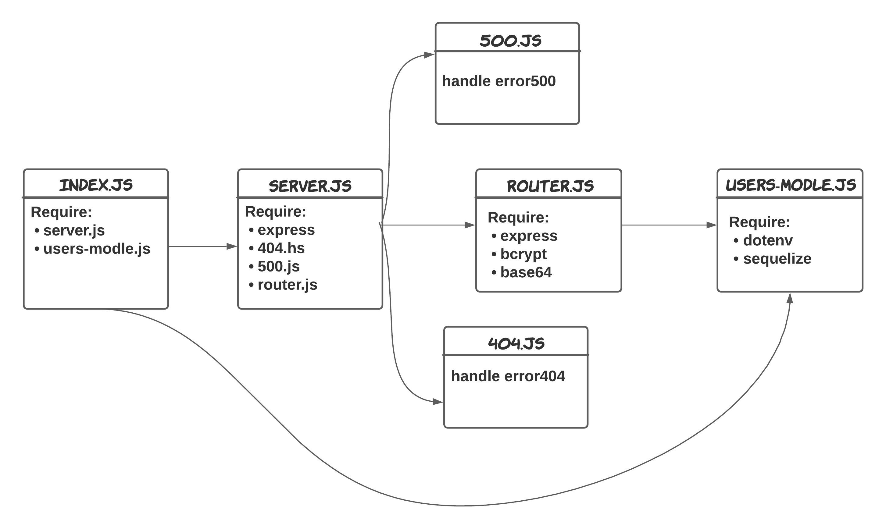

# *Bearer Authorization*
---

### **Summary work of the application**
Build Server app with some Authentication, and Bearer Authorization To check if the user had the authorized to give him the access.

### **UML Diagram**

---

### **Heroku App**
🔗[Heroku App](https://bearer-authorization-omar.herokuapp.com/)
### **GitHub Action**
🔗[GitHub Actions](https://github.com/OmarSawalmeh/bearer-auth/actions)
### **Pull Requests**
🔗[pull requests](https://github.com/OmarSawalmeh/bearer-auth/pulls)